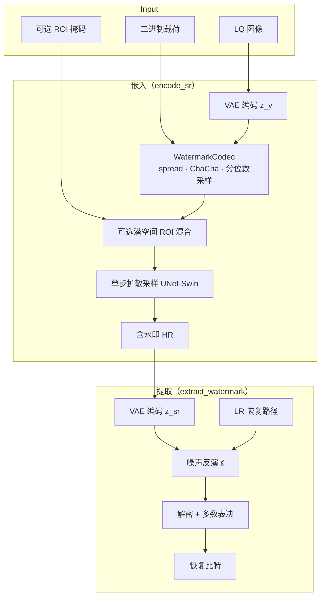

# RevMark-SinSR

面向医学超声等场景的 **可逆水印 + 单步超分辨率（SR）** 框架：在 SinSR 潜空间扩散一步重建流程中，将二进制载荷编码为高斯初始噪声，同步完成 4× 超分与水印嵌入；提取端从含水印 HR 图像半盲恢复载荷与 LR 条件。

本仓库在 [SinSR](https://github.com/wyf0912/SinSR) 蒸馏扩散 SR 基座之上，集成 **Gaussian Shading** 风格潜空间水印编解码（`WatermarkCodec`），并支持 **全图 / ROI 潜空间混合 / 像素域 ROI 回填** 等嵌入策略，默认在 BUSI 数据集上验证。

---

## 核心思路

| 环节 | 说明 |
|------|------|
| **SR 基座** | 条件 latent 扩散 + VQ 自编码器（`f=4`），单步 `p_sample_loop` 从 LR 生成 HR |
| **水印载体** | 载荷比特 → spread → ChaCha20/XOR → 分位数采样 → 潜噪声 `ε_wm`（形状与 VAE latent 一致，如 `3×64×64`） |
| **嵌入方式** | 以 `ε_wm`（或与纯高斯按 ROI 掩码混合后的噪声）作为扩散采样的 **初始噪声**，经 UNet-Swin 一步解码为含水印 SR |
| **提取方式** | HR 经 VAE 编码 + LR 估计（双三次 / 可选 `g_ψ` / 可选 LR 存储胶囊）→ 模型反演得 `ε̂` → sign + 解密 + 多数表决恢复比特 |

有效载荷长度由 `ch_factor`、`hw_factor` 与 latent 尺寸共同决定（例如 `ch_factor=1`、`hw_factor=8`、latent `64×64` 时宏块网格为 `8×8`，理论容量 **192 bit**；实验对比常固定使用前 **40 bit**）。

---

## 系统架构



---

## 仓库结构（核心模块）

```
RevMark-SinSR/
├── configs/                    # OmegaConf 配置（模型 / 扩散 / 水印 / 数据 / 训练阶段）
├── models/                     # UNet-Swin、Gaussian Diffusion、LR 恢复与存储相关网络
├── ldm/                        # VQ 自编码器（VQModelTorch）
├── datapipe/                   # 数据集与 Bicubic 等退化管线
├── utils/                      # 图像 IO、裁切对齐、ROI 掩码与分割辅助
├── watermark_codec.py          # 潜空间水印编解码（Gaussian Shading + ChaCha20）
├── sampler.py                  # BaseSampler：加载权重、扩散采样、VAE 编解码
├── inference_wm.py             # WatermarkSampler：encode_sr / extract_watermark / ROI 混合
├── trainer.py                  # SinSR 蒸馏训练基类
├── trainer_wm.py               # 水印联合训练（替换训练噪声、L_bin、攻击增强等）
├── main_distill_wm.py          # 水印训练入口
├── lr_storage_codec.py         # 可选：LR 字节级可逆存储（胶囊）
└── eval_busi_wm_e2e.py         # BUSI 端到端评测（质量 / 水印 / 鲁棒性入口之一）
```

> `scripts/`、`result/`、`external/` 等为实验脚本、结果归档与第三方基线环境，不属于核心推理/训练框架，上传 GitHub 时建议通过 `.gitignore` 排除大文件与虚拟环境。

---

## 嵌入分支（RevMark）

| 分支 | 行为 |
|------|------|
| **no_roi** | 全图使用含水印潜噪声 `ε_wm` |
| **roi_a** | 潜空间：`ε = M·ε_wm + (1-M)·N(0,I)`，非 ROI 为纯高斯；载荷在 ROI 外比特置 0；`roi_wm_in_roi=False` 表示水印写在非 ROI |
| **roi_b** | 与 roi_a 相同的潜空间嵌入，另在 **像素域** 将 ROI 内回填为无水印单步 SR（独立随机种子） |

ROI 掩码由 HR 分割图下采样至水印宏块网格（`8×8`）得到；无效 ROI 时自动退化为 `no_roi`。

---

## 环境依赖

```bash
pip install -r requirements.txt
# Windows 可参考 requirements-windows.txt
```

主要依赖：`PyTorch`、`omegaconf`、`opencv-python`、`pycryptodome`（ChaCha20）、`xformers`（可选加速）等。

### 预训练权重

将以下文件置于 `weights/`（可用 `scripts/Download-WeightsBusi.ps1` 或自行下载）：

| 文件 | 用途 |
|------|------|
| `SinSR_v1.pth` | SinSR 主模型 |
| `autoencoder_vq_f4.pth` | VQ 自编码器 |
| `resshift_realsrx4_s15_v1.pth` | 教师模型（训练蒸馏） |

BUSI 数据需先整理为 `data/BUSI_processed/` 及 `traindata/busi_*.txt` 列表（参见数据准备脚本，非核心包内逻辑）。

---

## 训练

水印联合训练继承 SinSR 蒸馏流程，在 `TrainerWatermarkDifIR` 中用 `WatermarkCodec` 生成的噪声替代随机高斯噪声，并支持分阶段损失（`phase` A/B/C：如 `L_bin`、攻击增强等）。

```bash
python main_distill_wm.py \
  --cfg_path configs/SinSR_wm_busi_smoke.yaml \
  --save_dir ./saved_logs \
  --steps 15
```

配置示例见 `configs/SinSR_wm_busi_smoke.yaml`（含 `watermark.ch_factor`、`hw_factor`、`use_chacha` 及 `train.phase`）。

---

## 推理

### 命令行（`inference_wm.py`）

```bash
# 嵌入：LQ + 载荷 → 含水印 SR
python inference_wm.py --mode encode -i <input_dir> -o <output_dir> \
  --ckpt weights/SinSR_v1.pth --cfg configs/SinSR_wm_busi_smoke.yaml --scale 4

# 提取：SR + keys → 恢复载荷
python inference_wm.py --mode extract -i <sr_image> \
  --ckpt weights/SinSR_v1.pth --wm_keys <keys.pkl>
```

### Python API

```python
from omegaconf import OmegaConf
from watermark_codec import WatermarkCodec
from inference_wm import WatermarkSampler

cfg = OmegaConf.load("configs/SinSR_wm_busi_smoke.yaml")
cfg.model.ckpt_path = "weights/SinSR_v1.pth"
codec = WatermarkCodec(
    num_channels=cfg.autoencoder.params.ddconfig.z_channels,
    latent_size=cfg.model.params.image_size,
    ch_factor=cfg.watermark.ch_factor,
    hw_factor=cfg.watermark.hw_factor,
    use_chacha=cfg.watermark.use_chacha,
)
sampler = WatermarkSampler(cfg, codec, sf=4)

# lq_t: (1,3,H,W) in [0,1]
sr, watermark, keys_info = sampler.encode_sr(lq_t, payload_bits=payload_grid)
decoded = sampler.extract_watermark(sr, keys_info, sf=4)
```

`encode_sr` 支持 `roi_wm_mask`、`roi_wm_in_roi`、`roi_segmenter` 等参数，详见 `inference_wm.py` 文档字符串。

---

## 配置要点

`configs/*.yaml` 中与核心框架相关的字段：

```yaml
model:
  target: models.unet.UNetModelSwin
  params:
    image_size: 64          # 潜空间边长
    cond_lq: true

diffusion:
  params:
    sf: 4                   # 超分倍率
    steps: 15
    latent_flag: true

autoencoder:
  target: ldm.models.autoencoder.VQModelTorch
  params:
    ddconfig:
      z_channels: 3

watermark:
  enabled: true
  ch_factor: 1
  hw_factor: 8
  use_chacha: true
```

---

## 水印编解码流程（`WatermarkCodec`）

1. **载荷整形**：`(B, wm_ch, wm_h, wm_w)`，其中 `wm_h = latent_size / hw_factor`
2. **Spread**：按 `ch_factor`、`hw_factor` 复制到完整 latent 分辨率
3. **加密**：ChaCha20（或 XOR）作用于展平比特流
4. **分位数采样**：按加密比特选择标准正态左/右半区间采样，得到 `ε_wm ~ N(0,I)` 边际
5. **解码**：`sign(ε̂)` → 解密 → **多数表决** 恢复宏块比特

---

## 致谢

- [SinSR](https://github.com/wyf0912/SinSR) — 单步实域图像超分基座  
- [ResShift](https://github.com/zsyOAOA/ResShift) — VQ 自编码器与教师权重  
- Gaussian Shading 系列工作 — 潜空间可逆水印思想  

---

## 引用

## 项目说明
##RevmarkSinSR在SinSR单步超分框架基础上构建超分处理与可逆水印嵌入一体化模型RevMarkSinSR，目标是在医学图像分辨率增强过程中同步实现水印信息写入与后续回读。与传统先超分后嵌入或先嵌入后超分的级联处理流程不同，在SinSR单步超分框架上，RevMarkSinSR将分辨率重建与可逆水印嵌入统一到同一生成映射中，低分辨率图像先编码为条件潜变量，水印比特经结构对齐、密钥随机化与分位映射后转化为高斯兼容扰动，并作为生成初态噪声参与单步重建。相较级联流程，该一体化设计减少了多阶段误差传递，缓解了纹理冲突，并提升了压缩扰动下的回读稳定性。同时针对医学影像场景引入ROI可控注入机制，控制水印信息优先注入非ROI区域。

##项目目录结构
```
RevMark-SinSR/
├── configs/                    # OmegaConf 配置（模型 / 扩散 / 水印 / 数据 / 训练阶段）
├── models/                     # UNet-Swin、Gaussian Diffusion、LR 恢复与存储相关网络
├── ldm/                        # VQ 自编码器（VQModelTorch）
├── datapipe/                   # 数据集与 Bicubic 等退化管线
├── utils/                      # 图像 IO、裁切对齐、ROI 掩码与分割辅助
├── watermark_codec.py          # 潜空间水印编解码（Gaussian Shading + ChaCha20）
├── sampler.py                  # BaseSampler：加载权重、扩散采样、VAE 编解码
├── inference_wm.py             # WatermarkSampler：encode_sr / extract_watermark / ROI 混合
├── trainer.py                  # SinSR 蒸馏训练基类
├── trainer_wm.py               # 水印联合训练（替换训练噪声、L_bin、攻击增强等）
├── main_distill_wm.py          # 水印训练入口
├── lr_storage_codec.py         # 可选：LR 字节级可逆存储（胶囊）
└── eval_busi_wm_e2e.py         # BUSI 端到端评测（质量 / 水印 / 鲁棒性入口之一）
```


## 项目声明
项目名称：面对医学图像超分辨率增强的可逆数字水印方案RevmarkSinSR 
项目作者：李长青
作者单位：暨南大学网络空间安全学院
开发语言：python
框架：PyTorch SinSR
核心技术：超分辨率、可逆数字水印、扩散网络、图像保护
